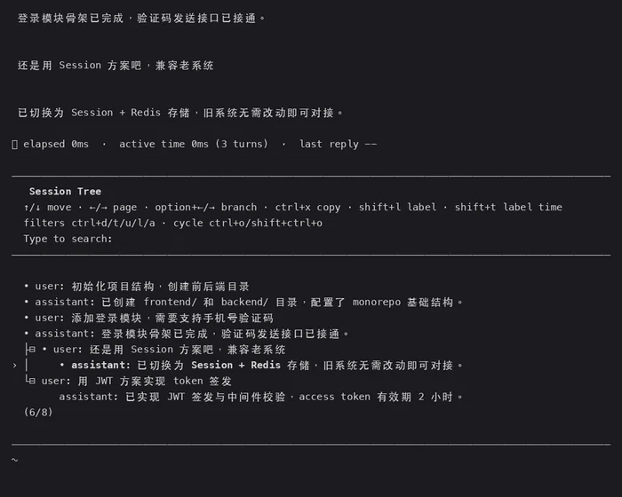
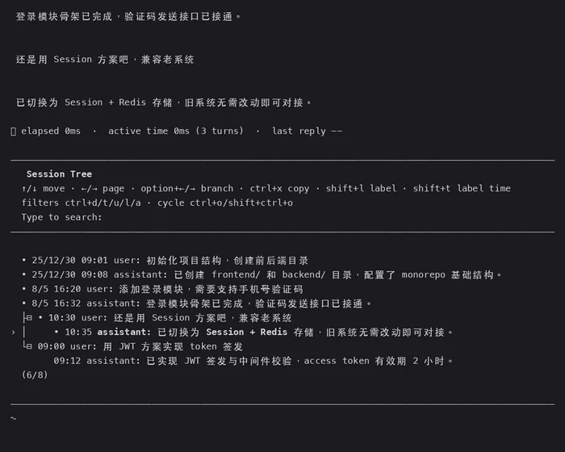

# pi-treetime

`/treetime` —— [pi](https://github.com/earendil-works/pi) 的会话树导航命令，**与内置 `/tree` 功能完全一致**，区别是每条消息都显示**人类可读的时间戳**。

<table>
  <tr>
    <td align="center"><b>内置 <code>/tree</code></b><br></td>
    <td align="center"><b><code>/treetime</code></b><br></td>
  </tr>
</table>

## 特性

- **与 `/tree` 完全一致**——导航、过滤、搜索、折叠、标签、复制、分支摘要流程全部相同：
  - `↑`/`↓` 移动，`←`/`→` 翻页
  - `Ctrl+←`/`Ctrl+→`（或 `Alt+←`/`Alt+→`）折叠分支 / 跳转分支段
  - `Enter` 选择（含相同的 "Summarize branch?" 摘要询问，尊重 `branchSummary.skipPrompt` 设置）
  - 摘要询问中可选 `Copy message`：复制选中消息并直接关闭，不导航、不中断会话状态
  - `Shift+L` 打标签 / 清除标签，`Shift+T` 显示标签时间戳
  - `Ctrl+X` 复制选中消息
  - `Ctrl+O` 循环过滤（default / no-tools / user-only / labeled-only / all），或 `Ctrl+D/T/U/L/A` 直达
  - 直接输入文字搜索
  - 正常触发 `session_before_tree` / `session_tree` 扩展事件钩子
- **每条消息都带时间戳**，格式智能：
  - 今天 → `HH:MM`（如 `10:30`）
  - 今年 → `M/D HH:MM`（如 `8/5 16:20`）
  - 更早 → `YY/M/D HH:MM`（如 `25/12/30 09:01`）

## 安装

```bash
pi install git:github.com/adamcjm/pi-treetime
```

或将 `extensions/pi-treetime` 目录复制到 `~/.pi/agent/extensions/`（项目级可用 `.pi/extensions/`）。

安装后执行 `/reload`（或重启 pi）生效。

### 本地开发

```bash
pi -e ~/.pi/dev/pi-treetime/extensions/pi-treetime/index.ts
```

## 使用

在 pi 中输入：

```
/treetime
```

即打开会话树——界面与 `/tree` 完全相同，只是每行多了时间戳。操作方式与 `/tree` 一致：`Enter` 跳转到选中位置（可选择摘要被放弃的分支），`Esc` 关闭。

## 实现原理

- 树渲染逻辑完整移植自 pi 内置的 `tree-selector.js`（水平视口裁剪、折叠、搜索、标签编辑、过滤模式），注入 `theme`/`keybindings` 并加入时间戳渲染。
- 时间取自会话条目自身的 `timestamp` 字段（Unix 毫秒或 ISO 字符串均可），显示为本地时区。
- 扩展 API 无法修改内置 `/tree` 的渲染，因此本扩展通过 `ctx.ui.custom()` 自绘等价选择器，并用 `ctx.navigateTree()` 完成导航——分支摘要与事件钩子行为与内置完全一致。
- 状态提示（如 "Navigated to selected point"）走标准状态栏 UI。

## 许可证

MIT
